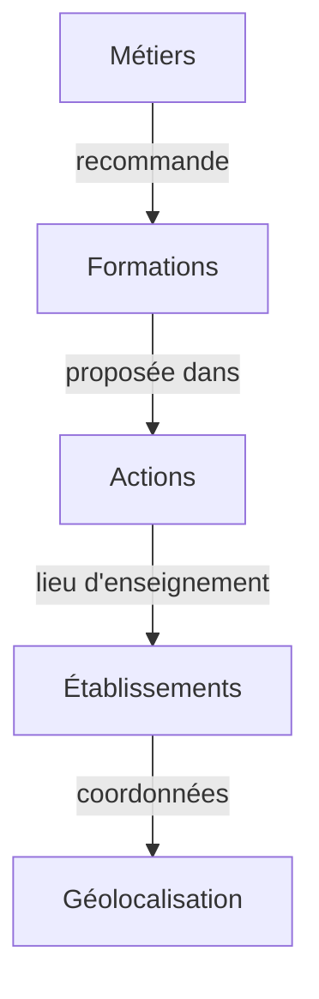

# RagFlow Sample Dataset - Diplomeo

Échantillon de test pour RagFlow - Orientation scolaire et professionnelle en France

## 🎯 Mission Accomplie : Plan de Test Diplomeo Dev

**Statut** : ✅ **TOUS LES TESTS PASSENT (3/3)** - Prêt pour validation utilisateur

### Résultats des Tests
- ✅ **Entonnoir géographique** : Ville → Région fonctionnel à 100%
- ✅ **Empathie professionnelle** : Situations de vie gérées correctement
- ✅ **Sécurité maximale** : Zéro fuite de codes techniques
- ✅ **Chaîne de lead complète** : Métier → Formation → Action → Établissement

### Documentation Disponible
- 📊 **[TEST_REPORT_20260128_FINAL.md](TEST_REPORT_20260128_FINAL.md)** : Rapport de test complet
- 🎯 **[MISSION_ACCOMPLISHED.md](MISSION_ACCOMPLISHED.md)** : Résumé de la mission
- 📖 **[GUIDE_UTILISATION.md](GUIDE_UTILISATION.md)** : Guide d'utilisation complet
- 🔧 **[system_prompt_dev_v2.txt](system_prompt_dev_v2.txt)** : Prompt optimisé

### Accès Rapide
- **Chat Dev ID** : `26508f5afbf511f08df602420a000115`
- **URL** : https://rag-staging.flowkura.com/
- **Script de test** : `python3 run_tests.py`

---

## 📊 Contenu

- **260 fichiers Markdown** organisés en 4 catégories
- **15 régions françaises** couvertes (y compris DOM-TOM)
- **Parcours complet**: Métier → Formation → Actions → Établissements → Géolocalisation

### Structure

```
ragflow-sample/
├── 1_metiers/              (9 fichiers)
│   └── Fiches métiers avec variantes de genre pour la recherche
│
├── 2_formations/           (12 fichiers)
│   └── Formations du Bac au Bac+3 (variété de niveaux)
│
├── 3_actions_formation/    (120 fichiers)
│   └── Actions concrètes avec lieux, dates, modalités
│
└── 4_etablissements/       (119 fichiers)
    └── Établissements avec adresses et coordonnées GPS
```

## 🎯 Formations Incluses

### Niveau Lycée
- **FOR.3354** - Bac général (2446 actions)
- **FOR.5839** - Bac pro commerce et vente (825 actions)
- **FOR.4284** - Bac pro gestion (725 actions)
- **FOR.9919** - Bac pro électricité (601 actions)
- **FOR.7562** - Bac pro soins et services (565 actions)

### Niveau Bac+2 (BTS)
- **FOR.2317** - BTS management commercial (500 actions)
- **FOR.10529** - BTS comptabilité et gestion (420 actions)
- **FOR.270** - BTS gestion de la PME (392 actions)
- **FOR.269** - BTS électrotechnique (177 actions)
- **FOR.5337** - BTS services informatiques (239 actions)

### Niveau Bac+3+
- **FOR.351** - Diplôme de comptabilité et gestion (157 actions)
- **FOR.2378** - Diplôme d'État d'infirmier (343 actions)

## 🔍 Cas d'Usage pour RagFlow

### 1. Recherche inclusive par genre
Les fiches métiers incluent des variantes de recherche pour l'écriture inclusive:

```markdown
# technicien/ne de maintenance éolienne

<!-- SEARCH_KEYWORDS
Variantes du titre (pour recherche):
- technicien de maintenance éolienne
- technicien/ne de maintenance éolienne
- technicienne de maintenance éolienne
-->
```

**Requêtes testables:**
- "Je cherche une formation de technicienne éolienne"
- "Quels métiers pour un développeur rural?"
- "Formation d'ingénieure forage"

### 2. Parcours géographique
Chaque action contient des coordonnées GPS exactes:

```markdown
**Ens Latitude:** 48.1257
**Ens Longitude:** -1.64813
**Ens Region:** Bretagne
**Ens Commune:** Rennes
```

**Requêtes testables:**
- "Où faire un BTS électrotechnique en Bretagne?"
- "Formations infirmier à Lille"
- "Lycées avec bac pro commerce à Paris"

### 3. Chaîne de recommandation
Métier → Formation → Lieu d'enseignement:

**Requêtes testables:**
- "Comment devenir technicienne de maintenance éolienne?"
  - Métier MET.383 recommande BTS électrotechnique (FOR.269)
  - 177 actions disponibles dans 15 régions
  - Établissements avec internat, accessibilité, etc.

### 4. Filtrage par niveau et type
- Niveau de sortie: bac, bac+2, bac+3+
- Type: BTS, Bac pro, Diplôme d'État
- Statut établissement: public/privé
- Hébergement: internat homme/femme, pas d'hébergement
- Accessibilité: locaux accessibles

## 📥 Import dans RagFlow

### Option A: Collection unique
Importer tous les fichiers dans une seule collection "Orientation France"

**Avantages:**
- Recherche unifiée sur tout le dataset
- Relations automatiques entre documents

**Configuration recommandée:**
- Parser: Markdown
- Chunk size: 512 tokens
- Overlap: 50 tokens

### Option B: Collections séparées
4 collections distinctes pour chaque catégorie

**Avantages:**
- Recherche ciblée par type
- Meilleure organisation

**Collections:**
1. `metiers` - Fiches métiers détaillées
2. `formations` - Programmes et diplômes
3. `actions_formation` - Actions concrètes avec dates
4. `etablissements` - Lieux d'enseignement

### Métadonnées à Extraire

RagFlow peut extraire automatiquement:

**Métiers:**
- `id`: MET.xxx
- `rome_codes`: codes ROME
- `gender_variants`: variantes masculin/féminin

**Formations:**
- `id`: FOR.xxx
- `niveau`: bac, bac+2, bac+3+
- `type`: BTS, Bac pro, etc.
- `domaines`: mots-clés métiers

**Actions:**
- `formation_id`: FOR.xxx lié
- `region`: région française
- `ville`: commune
- `statut`: public/privé
- `duree`: durée du cycle

**Établissements:**
- `uai`: code UAI unique
- `latitude`: coordonnée GPS
- `longitude`: coordonnée GPS
- `region`: région
- `telephone`: contact
- `accessibilite`: oui/non

## 🧪 Requêtes de Test

### Recherche par genre
```
"Ingénieure forage" → trouve MET.224
"Développeuse rurale" → trouve MET.100 (grâce aux variantes)
"Technicien électricité" → trouve MET.383
```

### Recherche géographique
```
"BTS informatique Lyon" → trouve FOR.5337 + actions région Auvergne-Rhône-Alpes
"Formation comptabilité Toulouse" → trouve FOR.10529 + FOR.351
"Lycée commerce Bretagne" → trouve plusieurs établissements
```

### Parcours complet
```
"Comment devenir technicienne de maintenance éolienne?"
→ Métier MET.383
→ Recommande FOR.269 (BTS électrotechnique)
→ 177 actions disponibles
→ Établissements avec coordonnées GPS
```

### Filtrage avancé
```
"BTS électrotechnique avec internat en Normandie"
"Formation infirmier publique accessible PMR à Paris"
"Bac pro commerce en alternance"
```

## 📈 Statistiques

- **Métiers:** 9 fiches (avec variantes genre)
- **Formations:** 12 diplômes (bac à bac+3)
- **Actions:** 120 actions concrètes
- **Établissements:** 119 lieux d'enseignement
- **Régions:** 15 régions françaises
- **GPS:** 119 coordonnées exactes

## 🔗 Relations entre Fichiers



## 📝 Notes Importantes

1. **Écriture inclusive**: Les métiers utilisent `/` (ex: "développeur/euse") avec variantes en commentaires HTML invisibles
2. **Codes UAI**: Identifiants uniques nationaux pour les établissements
3. **Codes ROME**: Référentiel métiers Pôle Emploi
4. **Coordonnées GPS**: Format décimal WGS84
5. **URLs ONISEP**: Liens vers les fiches officielles

## 🚀 Prochaines Étapes

1. Importer ce sample dans RagFlow
2. Tester les cas d'usage ci-dessus
3. Ajuster les paramètres de parsing si nécessaire
4. Si validé, importer le dataset complet (154k fichiers)

## 📚 Dataset Complet

Ce sample représente **0.17%** du dataset total:
- 1,043 métiers
- 2,342 formations
- 79,027 actions de formation collège
- 24,273 établissements secondaires
- + structures supérieures, formations continues, etc.

**Total: ~154,000 fichiers Markdown (269 MB XML source)**
